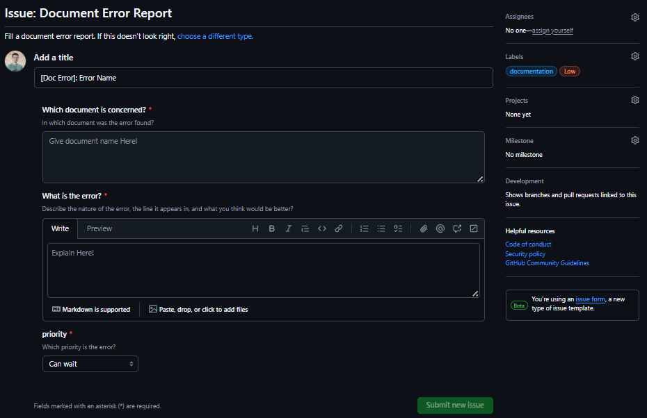
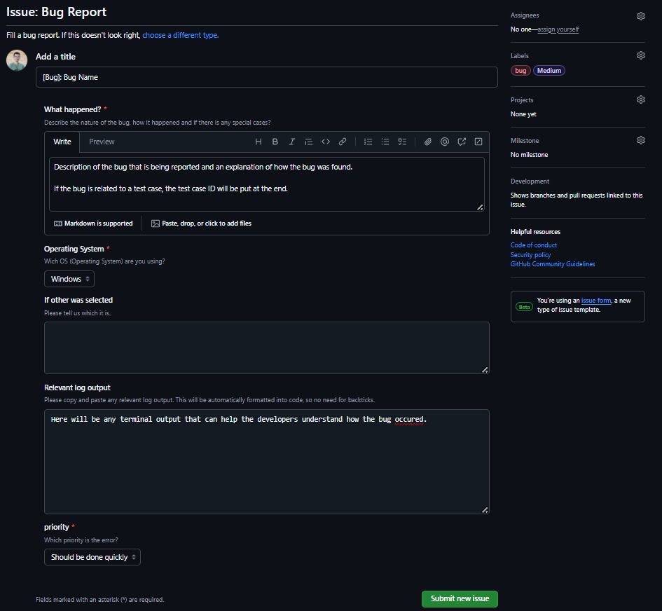

**
Dilemma
**
**
Test Plan
**

Laurent BOUQUIN

 

**
Team:
**

Thomas PLANCHARD, Max BERNARD, Quentin CLÉMENT, Clémentine CUREL, Paul NOWAK, David CUAHONTE

 

 ALGOSUP, Group 7. All Rights Reserved. 

Table of content

- [1. Introduction](#1-introduction)
- [2. Test Strategy and Criteria](#2-test-strategy-and-criteria)
	- [2.1. Testing Scope and Method](#21-testing-scope-and-method)
	- [2.2. Tools](#22-tools)
	- [2.3. Test Criteria](#23-test-criteria)
		- [2.3.1. Quality Assurance Testing](#231-quality-assurance-testing)
		- [2.3.2. End User Testing](#232-end-user-testing)
- [3. Test Plan Environment](#3-test-plan-environment)
- [4. Schedule Estimation](#4-schedule-estimation)
- [5. Deliverables](#5-deliverables)
- [Glossary](#glossary)
- [Footnotes](#footnotes)

## 1. Introduction

The goal of the project is to create a serious game that will raise awareness about climate change. The game will be a simulation of a country that needs to change the way ecology is handled in order to change the tragic future of the planet. 

## 2. Test Strategy and Criteria

### 2.1. Testing Scope and Method

The testing team will verify the quality of the program, as well as every documents.

For the documents, the testing team will verify the content, as well as the syntax and the grammar, to be sure that no misunderstanding is left over, and thus having clear and readable documents for the client, and also for the team. In case of a problem in the content, the subject will be discussed with the team to find a solution that corresponds to the problem. If there is a problem with the syntax or the grammar, the QA[^qa] of our group will check the mistake then verify it using external tools and if the mistake is proven, an issue will be created on Github[^6] using the template for `Document Error Report` syntax errors. Once the issue is created, the person responsible for the document will be in charge of modifying the document and closing the issue.

For the program, the testing team will verify the quality of the code, as well as the quality of the program itself. Using the `Test_Cases.md` file, the testing team will be able to test the program and verify if the program is working properly. If the program is not working properly, the testing team will create an issue on Github[^gh] using the template for `Bug Report` to report the problem. The issue will be created with the maximum of details possible to help the developers to understand the problem and to fix it.

We have decided to give to each issue that we find a different level of importance. Those level of importance will help us to tell if it is relevant or not to fix it directly or if it can wait, and thus helping us having a better organization. The different level of importance are :

|                           Category                            | Level of importance |                        Description                        |
|:-------------------------------------------------------------:|:-------------------:|:---------------------------------------------------------:|
|                   ${\color{green}Optional}$                   |       Lowest        | Task not important but can be done if there is time left  |
|               ${\color{orange}Can \space wait}$               |         Low         |   Task not important but should be done sometimes soon    |
| ${\color{purple}Should \space be \space done \space quickly}$ |       Medium        |        Task that alter the quality of the project         |
|                     ${\color{red}Urgent}$                     |       Highest       | Task that alter the quality of the project and can't wait |

Their name are explicit to help us understand much quicker the importance of the issue.

### 2.2. Tools

To report issues, we will use a functionality of Github[^gh], called Github Issue[^ghi]. It helps us to do reports faster, and to have reports easier to read. We have decided to make two types templates for the reports, one for the documents and one for the program.

The report template for the typographical errors tells which document is concerned, what are the errors and what is its priority. 

The report template for the bugs tells what happened during the testing, which operating system was used, and a way to tell which operating system was used if it was not in the selection box, the log outputs for more precise information and its priority.

### 2.3. Test Criteria

We will judge if the program is working properly by testing each function of the program that can be tested. 

#### 2.3.1. Quality Assurance Testing

We will use the `Test_Cases.md` file to help us to test the program. The test cases will be written by the QA[^qa] of the group, and will be reviewed by the team to be sure that the test cases are correct and that they are testing the right things. 

The test cases will be executed by the QA of the group on each [environment available](#3-test-plan-environment), and the results will be reviewed by the team to be sure that the program is working properly. 

If the program is not working properly, the QA will create an issue on Github[^gh] using the template for `Bug Report` to report the problem. 

The issue will be created with the maximum of details possible to help the developers to understand the problem and to fix it.

Each issue will be given a level of importance, to help the developers to know if the issue is important or not. The different levels of importance are :

|   Level of importance    |                                                    Description                                                     |
|:------------------------:|:------------------------------------------------------------------------------------------------------------------:|
|   ${\color{green}Low}$   |               This bug should not affect the quality of the project but should be fixed if possible                |
| ${\color{orange}Medium}$ |     The quality of the project can be affected by this bug and needs to be fixed before the end of the project     |
|   ${\color{red}High}$    | The quality of the project is affected by this bug and needs to be fixed for the project to be delivered correctly |

For each new important version of the program, the QA will have to test every test cases to be sure that the program is working properly.

#### 2.3.2. End User Testing

After the game has enough features to be tested by the end user (MVP[^mvp]), the QA[^qa] will find a group of people, that enter the scope of target users, to test the game on one of specified environments.

For each external tester, the QA will give a brief explanation of the game, and will ask the tester to play the game and to give feedback on the game.

The feedback will be written by the QA, depending on what the tester said and on what the QA saw. 

If the feedback can be considered as a bug, the QA will create an issue on Github[^gh] using the template for `Bug Report` to report the problem. However, if the feedback is not a bug, the QA will send the feedback to the team to discuss it and decide if it is relevant or not to implement it.

## 3. Test Plan Environment

Our team members have different computer OS, which are Windows and MacOs, that gives us the opportunity of testing that the program is working properly on the different OS. But also the environment is different and so the steps to be capable to test are different.

The tests will be run on the following environments:

| Specifications   | Lenovo ThinkBook 14  | Apple MacBook Air M3 2024 |
|------------------|:--------------------:|:-------------------------:|
| Processor        | Intel Core i7-1165G7 |         Apple M3          |
| RAM              |        16 GB         |           16 GB           |
| Operating System | Windows 11 Pro 22H2  |   macOS Sequoia 15.1.1    |

## 4. Schedule Estimation

It is necessary to correctly spread out our time between each task, so we can be more efficient on the tests we have to do. Our total number of hours we have is 104 hours.

| Task                              | Subtask                                                                                       | Time estimation                           |
|-----------------------------------|-----------------------------------------------------------------------------------------------|-------------------------------------------|
| Analyze requirement specification | - Review functional specifications   - Review technical specification                      | - 6 hours   - 6 hours                  |
| Create the test specifications    | - Create the test plan   - Create test cases   - Review the test cases                  | - 20 hours   - 12 hours   - 4 hours |
| Execute the test cases            | - Build up the test environment   - Execute the test cases   - Update test cases status | - 10 hours   - 14 hours   - 6 hours |
| Report the bug                    | - Create bug reports   - Create bug data report                                            | - 6 hours   - 6 hours                  |

If this estimation is correct, we will have spent 90 hours for the quality assurance of the project, as our number of working time we have available.

## 5. Deliverables

The testing deliverables for this project are :
- From the client:
	- The Test Plan ( 12/06/2024 at 5:00pm )
	- The Test Cases ( 12/06/2024 at 5:00pm )
- From the team :
	- The Bugs Report ( 12/13/2024 at 5:00pm )

## Glossary

|        Term        |                                                                                                 Definition                                                                                                 |                                      additional content                                      |
|:------------------:|:----------------------------------------------------------------------------------------------------------------------------------------------------------------------------------------------------------:|:--------------------------------------------------------------------------------------------:|
|      QA[^qa]       | Quality Assurance is the term used in both manufacturing and service industries to describe the systematic efforts taken to assure that the product(s) delivered to customer(s) meet with the contractual. |                 [Wikipedia](https://en.wikipedia.org/wiki/Quality_assurance)                 |
|    Github[^gh]     |                                                   GitHub, Inc. is a provider of Internet hosting for software development and version control using Git.                                                   |                      [Wikipedia](https://en.wikipedia.org/wiki/GitHub)                       |
| Github Issue[^ghi] |                                                          Issues are a great way to keep track of tasks, enhancements, and bugs for your projects.                                                          | [Github](https://docs.github.com/en/issues/tracking-your-work-with-issues/creating-an-issue) |
|     MVP[^mvp]      |                        A minimum viable product (MVP) is a development technique in which a new product or website is developed with sufficient features to satisfy early adopters.                        |              [Wikipedia](https://en.wikipedia.org/wiki/Minimum_viable_product)               |

## Footnotes

[^qa]: [Wikipedia - Quality Assurance](https://en.wikipedia.org/wiki/Quality_assurance)
[^gh]: [Wikipedia - Github](https://en.wikipedia.org/wiki/GitHub)
[^ghi]: [Github - Github Issue](https://docs.github.com/en/issues/tracking-your-work-with-issues/creating-an-issue)
[^mvp]: [Wikipedia - Minimum Viable Product](https://en.wikipedia.org/wiki/Minimum_viable_product)