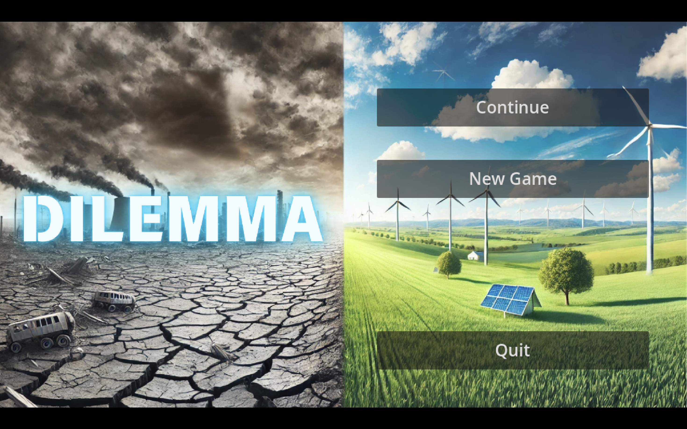

# Technical Specifications

## Table of Contents

<details>
<summary>Click to expand</summary>

- [Technical Specifications](#technical-specifications)
  - [Table of Contents](#table-of-contents)
  - [Document Evolution](#document-evolution)
  - [1. Overview](#1-overview)
    - [1.1. Document Purpose](#11-document-purpose)
    - [1.2. Game Presentation](#12-game-presentation)
  - [2. Game Architecture](#2-game-architecture)
    - [2.1. Target Platform](#21-target-platform)
    - [2.2. Modules and Components](#22-modules-and-components)
    - [2.3. Other External IT Tools](#23-other-external-it-tools)
    - [2.4. Files Organization](#24-files-organization)
  - [3. Technologies Used](#3-technologies-used)
    - [3.1. Game Engine Presentation](#31-game-engine-presentation)
    - [3.2. Data Management](#32-data-management)
    - [3.3. Programming Language](#33-programming-language)
    - [3.4. Non-Functional Requirements](#34-non-functional-requirements)
    - [3.5. Risks & Assumptions](#35-risks--assumptions)
  - [4. Mechanics and Systems Details](#4-mechanics-and-systems-details)
    - [4.1. Setting up Game Manager](#41-setting-up-game-manager)
    - [4.2. Managing Game Economies](#42-managing-game-economies)
    - [4.3. Game Progression](#43-game-progression)
    - [4.4. Event Management](#44-event-management)
  - [5. Gameplay](#5-gameplay)
    - [5.1. Controls Handling](#51-controls-handling)
    - [5.2. Graphics and Visuals](#52-graphics-and-visuals)
    - [5.3. Sound Design](#53-sound-design)
  - [6. Version Control](#6-version-control)
  - [7. Glossary](#7-glossary)

</details>

## Document Evolution

| Author        | Paul NOWAK (Tech Lead) |
|---------------|------------|
| Created       | 11/21/2024 |
| Last modified | 12/16/2024 |
| Document deadline | 11/29/2024 |

## 1. Overview

### 1.1. Document Purpose

The purpose of this document is to outline the technical requirements, objectives, and constraints for our game. It serves as a detailed plan to guide the development process.

Building on the Functional Specifications document, this plan introduces the software architecture of Dilemma, shaped by key elements such as the Godot game engine and specific libraries used to implement features.

This document aims to ensure seamless communication between the Tech Lead and Software Engineers, providing clear guidance for future technical decisions.

### 1.2. Game Presentation

Dilemma is a point-and-click strategy game with serious undertones, where the player assumes the role of a nation's leader. The objective is to balance economic stability with environmental sustainability.



Set in a dystopian world, the game aims to raise awareness about global warming. The player must navigate challenging decisions to avoid either economic collapse or catastrophic environmental disaster. Gameplay centers around an office environment equipped with a large screen displaying a world map, as well as interactive control panels.

At the start, the player selects a country to manage from the available options on the map. They must then juggle two critical metrics: Economy and Temperature, striving to maintain balance not only within their country but across the globe through strategic choices.

The player oversees various sectors of their country, allocating resources to research, legislation, and diplomacy. Each decision impacts both their nation and the world, requiring careful prioritization to avoid detrimental outcomes.

The game progresses in turns, with each turn representing a year. Players receive income through taxation on different sectors and must make decisions before clicking the "Pass Time" button to advance to the next year and observe the global consequences.

The ultimate goal is to grow the nation’s economy, foster global collaboration, and minimize greenhouse gas emissions, creating a sustainable future for the world.

## 2. Game Architecture

### 2.1. Target Platform

The Godot editor supports Windows, macOS, and Linux. Our software engineers primarily use macOS on MacBook computers for development and testing. This ensures Dilemma performs well on macOS. 

However, we will release the game on both macOS and Windows. This leverages Godot's cross-platform features and reaches a wider audience.

Once we have selected our target platforms and completed the development of our game, we will need to export the project. Developers will compile the appropriate binaries and build the required packages for each target platform.

To export the project in Godot, we navigate to the Project menu and select Export. From there, we choose an export preset corresponding to our target OS:


For macOS, we select the macOS preset, ensuring that all required additional tools are installed for exporting. Similarly, for Windows, we choose the Windows Desktop preset.

After selecting the desired preset, we can either click on Export Project to create a playable build or export the project resources as a PCK or ZIP package. The latter option includes only the project data without a playable build or Godot executable.

### 2.2. Modules and Components

The game architecture of Dilemma is organized into modular components to ensure maintainability, scalability, and ease of collaboration. Each module is responsible for a specific aspect of the game’s functionality, which is divided into the following categories:

- **Core Systems**:
The core module manages essential game-wide functionality, providing a foundation for the entire project:

  - **GameManager.cs**: Handles global game state and progression.
  - **InputHandler.cs**: Centralized input management to process player actions.
  - **DataLoader.cs**: Reads and writes external data files such as JSON configurations.
  - **GlobalVariables.cs**: Contains constants and globally accessible variables.

- **Feature Modules**:
These modules define the game’s primary features and mechanics:

  - **Home Country**: Manages the assets, gameplay logic, and UI elements related to the player's country. Includes submodules like installations (e.g., nuclear plants, greenhouses) and country-specific UI.
  - **World Map**: Manages the global map, assets for other countries, and their interactions. Includes country-specific data and logic for non-player nations.
  - **Management Systems**: Governs gameplay aspects such as economy and pollution mechanics. Includes managers like economiesManager.cs for balancing resources and monitoring player progress.
  - **Event Manager**: Handles dynamic in-game events such as natural disasters or global crises. Includes progression tracking to evolve gameplay over time.

- **User Interface (UI)**:
This module includes all UI components, ensuring players can interact with the game seamlessly:

  - **Menus**: Main menu, settings menu, and world map menu.
  - **Gameplay UI**: Interfaces for research and development (R&D), laws, diplomacy, and more.

-**Resources**:
Resources include all reusable assets that support game functionality and aesthetics:

  - **Images**: Sprites, backgrounds, and icons.
  - **Sounds and Music**: Audio files for sound effects and background music.
  - **Fonts**: Typography used across UI elements.

-**Data and Tools**:
This module contains external configurations and development utilities:

  - **Data**: Stores JSON files for level configurations, dialogues, and game settings.
  - **Tools**: Includes plugins, shaders, and testing utilities to streamline development.

Each module is designed to operate independently, allowing developers to update or expand features without disrupting the overall game structure. This modular design approach ensures that Dilemma remains flexible and efficient as new features are introduced.

### 2.3. Other External IT Tools


Slack is a management and collaborative software that allow our teammembers to communicate efficiently. Allowing us to create projects for managing tasks through different channels, it's a useful tool to share valuable information such as code blocks or technical choices.


Github is a cloud-based platform that allow its users to create coding projects through repository and work together to store and share code. Indeed, it give us the feature to track and manage our changes over time.

### 2.4. Files Organization

At first, we need to organize our files in github in a tree-like structure:

```  
origin  
│
├── documents
│    │
│    ├── Management
│    │    ├── data
│    │    ├── Weekly_reports/
│    │    └── Project_charter.md
│    │
│    ├── Functional_specifications
│    │    ├── data
│    │    └── Functional_specifications.md
│    │
│    ├── Quality_assurance
│    │    ├── data
│    │    ├── Bug_Tracker.md
│    │    └── Test_plan.md
│    │
│    ├── User_manual
│    │    └── User_manual.pdf
│    │
│    └── Technical_specifications
│         ├── data
│         └── Technical_specifications.md
│
├── Dilemma/
│    │
│    ├── game_project_root/
│         ├── core/
│         └── features/
│         └── ... (other modules) 
│
└── README.md
```

Then, here's how we plan to structure the different files of our game in the Godot Game Engine:

```  
/game_project_root
├── core/                   # Core systems and global logic
│   ├── GameManager.cs       # Main game logic singleton
│   ├── InputHandler.cs       # Centralized input handling
│   ├── DataLoader.cs         # JSON or data handling scripts
│   ├── GlobalVariables.cs             # Global variables or constants
│   └── autoload/            # Singleton scenes or nodes
│       ├── GameManager.tscn 
│       └── Settings.tscn
├── features/               # Game feature implementations
│   ├── homeCountry/              # homeCountry-specific assets and logic 
│   │   ├── homeCountry.tscn
│   │   ├── homeCountry.cs 
│   │   ├── installations/       # the institutes (nuclear plants, green houses, etc..) built by the player
│   │   └── ui/               # homeCountry-related UI elements
│   ├── worldMap/           # worldMap-specific assets and logic 
│   │   ├── worldMap.tscn
│   │   ├── worldMap.cs 
│   │   ├── countries/       # list of other countries with their specific assets and logic 
│   ├── Management game-specific logic 
│   │   ├── systems/          # Resource, task, or economy systems
│   │   │      ├── Economy.tscn
│   │   │      ├── Pollution.tscn
│   │   ├── ui/               # UI specific to the management gameplay
│   │   └── managers/         # Task, worker, or building managers
│   │   │      ├── economiesManager.cs 
│   ├── EventManager/              #Manage game events (like natural disasters, or conflicts)
│   │   ├── EventManager.cs  
│   │   ├── Events/ #List of events 
│   │   └── progression/         # Check the gameplay evolution when time flies
│   └── ui/                  # General UI for the game
│       ├── MainMenu.tscn     # Main menu
│       ├── SettingsMenu.tscn # Settings menu
│       └── WorldMapMenu.tscn    # World Map Menumenu
│       ├── RnDMenu.tscn     
│       ├── LawsMenu.tscn  
│       └── DiplomacyMenu.tscn    
├── resources/              # All reusable assets
│   ├── images/              # Textures, sprites, and icons
│   │   ├── environments/     # Backgrounds and scenery
│   │   ├── ui/               # UI elements like buttons, panels
│   │   └── installations/    # Icons of buildable installations in-game
│   ├── sounds/              # Sound effects
│   ├── music/               # Background music
│   ├── fonts/               # Game fonts for UI  
├── data/                   # External configuration and data
│   ├── config.json          # Game configuration data
│   ├── levels.json          # Level-specific configurations
│   ├── dialogues.json       # NPC dialogues and text
├── tools/                  # Plugins, shaders, and utility tools
│   ├── shaders/             # Custom shaders
│   │   ├── lighting.shader
│   │   ├── worldMap.shader 
│   │   └── ui.shader
│   ├── plugins/             # Godot editor plugins or third-party tools
│   │   ├── dialogue_system/
│   │   └── input_customizer/
│   └── testing/             # Debugging and test tools
│       ├── test_scripts.cs 
│       └── mock_data/       # Mock data for test cases
└── project.godot           # Godot project configuration file
```  

## 3. Technologies Used

### 3.1. Game Engine Presentation


Godot is a free and open-source game engine designed to make all sorts of 2D and 3D projects, especially centered around video games that can be released on PC, mobile, or even consoles. Beginner-friendly, it was initially developed in-house by an Argentian game studio until it has been rewritten and incredibly updated since its open-source release in 2014.

The app possesses a full-fledged game editor with integrated tools to control several needs, such as code, animation, tilemap, or shader, while offering a consistent user experience with a rich user interface. 

Its 2 main programming languages are GDScript, a Godot-specific and tightly integrated language with a lightweight syntax, or C#, which is very common in the video game industry. Indeed, the game engine relies on the object-oriented programming paradigm, introducing concepts such as classes and objects to help you run the code properly.

In fact, Godot is well-known for its efficient rendering pipeline and flexible optimization options, which allow the user to tweak the game's required performance.

### 3.2. Data Management

Due to the importance of the system of nodes involving Money and Pollution, we need a proper strategy to save and load game data efficiently.


Subsequently, we have decided to use JSON, a text format whose conventions are familiar to the C-family of programming languages, like C# which is the programming language for our Godot Project. Indeed, JSON is simple to understand and allows the creation of objects written as Key/Value pairs.

For example, we create a JSON format for storing the Money and Pollution value of each node from our home country:

```json
  {
  "Energy": {"Money": 3000000, "Pollution": 0.4},
  "Transport": {"Money": 2000000, "Pollution": 1.2},
  "Education": {"Money": 3000000, "Pollution": 0.3},
  "Consumer Good": {"Money": 2000000, "Pollution": 1.3},
  "Raw Resources": {"Money": 3000000, "Pollution": 1.5},
  "Fuel": {"Money": 2000000, "Pollution": 2.0}
  }

```

With each country treated as single entity, which makes the data consistent and allow to simplify operations when updating the values at each turn.

The data is handled within the script DataLoade.cs, a child node of the Core Parent Node, and which controls the most of the storage of the game elements' variables.

In fact, Godot uses a dictionnary to serialize with JSON thanks to its inbuilt tools, and use the System.IO library that allow to create a static path of your .json file no matter where the game is saved.

When the game starts, a .json file is generated for a game object. At the start of each turn, the game retrieves the necessary data from this file, updates it as needed, and saves the modified values back into the .json file.

### 3.3. Programming Language

First of all, we have decided to use C# as the main programming language of our game. Using the ### version, we chose this high-level programming language over the built-in language GDScript because it allows a faster runtime of our scripts, and most of our team members are familiar with it.

In addition, some game elements like countries or game states would require interfaces, abstract classes, and properties, and C# would provide a more structured code for this complex project.

Furthermore, Dilemma would require a lot of optimization due to the load of multiple assets on screen, the data management with JSON files, and the progress of our games through different events and scenarios. C# would provide the right amount of optimization required for the development of a serious game.

### 3.4. Non-Functional Requirements

Here are the different criteria for the non-functional requirements:

#### Performance

We want to maintain smooth gameplay at 60 fps, load pop-up menus in under 3 seconds, and limit memory usage below 2GB during peak loads.

For that, we will use Godot's built-in monitor to check FPS, memory usage, and GPU/CPU load during gameplay. To optimize the different scenes, we can preload certain objects and assets to reduce loading time and use compressed pictures for large pictures and images.

#### Responsiveness

We want user interactions, such as mouse clicks or keyboard presses, to be registered within 0.1 seconds, and menu transitions to feel smooth and instantaneous.

For that, we will use Godot's InputEvent system to handle inputs with low latency. We will offload heavy tasks to background processes using Coroutines (yield) or Threads to prevent interruptions in responsiveness. Input handling will be prioritized by processing events in the _input() function to minimize delays.

#### Usability  

We want to provide an intuitive user interface with features such as scalable text, subtitles, and accessibility options for colorblind players. All actions in the game should require no more than three steps to complete.

For that, we will use Control Nodes in Godot (e.g., VBoxContainer) to ensure adaptive UI layouts that work across various screen sizes. We will implement DynamicFont for text scaling and use contrast analysis tools in Godot's Theme Editor to enhance readability. Colorblind-friendly options will be provided via shader effects, and visual/audio feedback will be added using Tween Nodes for click responses and transitions.

#### Reliability   

We want the game to remain stable, save player progress at key checkpoints, and recover seamlessly after crashes.

For that, we will implement an autosave system using Godot's File API to save game states in JSON format during key events. Crash recovery will be supported by logging errors using Godot's Logger, which will store detailed error reports in external log files. We will use Godot’s Debugger to trace issues during development and conduct rigorous testing to ensure stability.

#### Maintainability   

We want the code to be modular, enabling developers to update or replace individual components without affecting the entire system. 

For that, we will design modular scenes using Godot’s Scene Tree to isolate different systems (e.g., UI, game mechanics). Signals will be used for event handling to ensure loose coupling between components. Version control will be managed through Git, with clear branching strategies and commit messages. 

### 3.5. Risks & Assumptions

| Risks | Assumptions | 
| ------| ----------- | 
| Having several countries in active evolution can increase loading time and be problematic for such an important feature. Indeed, each transition to the next turn could trigger lags as it involves the calculations of several data from each country.| We should pre-program the evolution of such countries with algorithms that could allow them to evolve differently per game.  |
| It could take a while to load dynamic data, such as a country's income, and display it on screen. | To use less space, we could decide to display the data only when the player selects a certain country to retrieve information. Then we will have to click it again to stop displaying it.  |
| Implementing music and sound effects can trigger lag during gameplay. | A single and simple background music, accompanied by limited use of sounds, would be wiser.  |
| Because many mechanics (home country, other countries, Laws, Research, and Diplomacy) are connected to a system of nodes (Economy and Pollution), a bug from one of the scripts could lead to many errors in the other connected scripts.| We have to build the global system management script piece by piece, testing it each time we connect it to a new script, and making sure it only calls a certain script only if needed. Furthermore, we can implement a database to allow better storage of certain pieces of data. |
| We could encounter issues while trying to export our game, and the chosen export templates might not be compatible with our game. | We have to study further which export template is necessary for Dilemma, and test the export as we are progressively creating the game.  |
| When we go to another menu (Research, Laws, Diplomacy...) and we need to go back to the main scene, we should expect a long loading time to display all the assets of the world map.  | The other menus could be either pop-up, or we should pre-program the apparition of the world map assets.  |
| The game could encounter retro compatibility issues when the two Software Engineers are working with MacBook computers.| We should focus on the development phase with MacBook computers, and do the testing with the same operating system.|


## 4. Mechanics and Systems Details

### 4.1. Setting up Game Manager

As we create new nodes and scripts, the game grows more in complexity, and we need a more robust solution to handle properly Dilemma's main mechanics and systems.

For that, we create a node named "Core" to handle the core elements, such as the data loading or the declaration of global variables. Here, we will create a GameManager.cs script to handle the main logic of our game.

To start with, we need to instantiate the most important scenes of our game:
- gameManager.tscn: contains the core systems and logic of our games, including the GameManager.cs script itself.
- homeCountry.tscn: contains the scripts and logic of the country selected by the player. It allows to set up a country to manage and follow its evolution when the game is progressing. It will become mostly active once the game enters in Play state. 
- worldMap.tscn: contains the scripts and assets required for the entire world map. Setting it up will handle the gameplay by interacting with the interface, and also to set the the other countries of the world.

Other scenes will also be instantiated, but they will be more focused on the different menus and the other countries which will complete the game depending on how far the player goes.

Furthermore, the game manager will have to check several features each time the _Process() function is called:
 - the inputHandler.cs script, where the game manager will monitor the use of the player's interface and its point-and-click controls, a vital part of the gameplay.
 - the dataLoader.cs script, necessary each time the game updates to the next turn to change the .json script's values and the game economies.
 - the homeCountry.cs script: monitor the actual state of the player's chosen country and its different economies.
 - the worldMap.cs script: check the state of the world, the global economies, and the other countries
 - the eventManager.cs script: handles the different events performed by the player, such as the changes applied to the economy's nodes, and when he decide to go to the next turn and update most of the game's objects.

### 4.2. Managing Game Economies

Managing the 2 main Game Economies, Economy and Pollution, is one of the most important points of the code. Indeed, it requires a lot of calculations depending on the various aspects of the economy and the player's actions.

The script economiesManager.cs takes its importance here, as it performs the various calculations required depending on the value retrieved from the stored .json files and updates them.

#### Total Tax Income Calculation:
Let:
- \( N \): the number of nodes.
- \( V_i \): the value in the \( i \)-th node.
- \( T_i \): the tax multiplier for the \( i \)-th node.
- \( T_{income} \): the total tax income.

The total tax income received by the player is given by:
$$
T_{income} = \sum_{i=1}^N \left( V_i \cdot T_i \right)
$$

#### Aid Income Calculation:

When your country receives money from allied nations, it is split into three parts: one to develop a specific node chosen by the donator, one to your Income, and the rest is lost to simulate administrative inefficiency.

Let:
- \( D_i \): the value of the \( i \)-th donation, sorted in descending order (\( D_1 \geq D_2 \geq \dots \)).
- \( I_i \): the income derived from the \( i \)-th donation.
- \( N \): the total number of donations.

1. For the first donation (\( i = 1 \)):
   $$
   I_1 = \frac{D_1}{5}
   $$

2. For each subsequent donation (\( i \geq 2 \)):
   $$
   I_i = \frac{D_i}{5} \cdot (1 - 0.1(i - 1))
   $$

3. Total aid income (\( A_{income} \)):
   $$
   A = \sum_{i=1}^N I_i
   $$

#### Supply and demand

When a sector grows or shrinks, so does it's need.

As a remind [spreadSheet](https://docs.google.com/spreadsheets/d/1nBxIMelLl4439p4A0lBnOFLjVdy7G12d8wt_ZIThWdA/edit?usp=sharing) details the interaction between the different nodes.

We have an equation to show how long it takes supply to catch up to demand.

Let the value be \( V_t \), the demand be \( D \), and the growth rate at time \( t \) be \( r_t \). The value at the next turn is \( V_{t+1} \).

##### => General Case:
- **If** \( V_t + 6\% \times V_t \leq D \), the growth rate is 6%, so:
  \[
  V_{t+1} = V_t + 0.06 \times V_t = V_t (1 + 0.06)
  \]
  
- **If** \( V_t + 6\% \times V_t > D \), then the growth rate reduces to 3% to avoid overshooting the demand, so:
  \[
  V_{t+1} = V_t + 0.03 \times V_t = V_t (1 + 0.03)
  \]

##### => Stopping Condition:
- The growth stops when \( V_t \geq D \), i.e., when the value reaches or exceeds the demand.

\[
V_{t+1} = \begin{cases} 
V_t (1 + 0.06) & \text{if } V_t + 0.06 \times V_t \leq D \\
V_t (1 + 0.03) & \text{if } V_t + 0.06 \times V_t > D \\
\end{cases}
\]
\[
\text{Stop when } V_t \geq D
\]

#### Effect of Taxes

The rate of growth \( r_{\text{final}} \) after applying the tax reduction can be expressed as:

\[
r_{\text{final}} = r \times \left( 1 - 2 \times \frac{t}{100} \right)
\]

Where:
- \( r \) is the original rate of growth (in percentage),
- \( t \) is the tax rate (in percentage).

Anyway, this money system diagram shows how the economy circulates through the different nodes:


### 4.3. Game Progression

The game is attributed to several states:
 - Start state: the game has just been launched, showing the main Menu which incites the player to select "New game" to play. By default, the game manager has this state when it's launched through the _Ready() function.
 - Intro state: after selecting "New Game", the game plays an initial cutscene showcasing the story and allowing the player to understand the plot. 
 - Select state: once the first cutscene finished playing, the player will be introduced to the world map. Then, he will have to decide which home country he has to choose and confirm before starting to play the actual game.
 - Play state: the main state of our game manager where most of the scripts are connected with. 
 The player finds himself in his control room, obtains his initial amount of income, and has access to the world map and the other menus allowing him to manage the Economy and the Pollution. 
 He can decide to go to the next turn once he finished his limited actions, and the game progresses through the different events and player's choices, but the game manager is still in "Player state" until the game reaches the 50th turn.
 - Ending state: When the turn 50 is over, the game analyzes the player's entire progress and calculates how well he managed to balance the Economy and Pollution economies. Depending on the results, the game manager will either trigger a good or bad ending cutscene.

 The reason to use states is to have a better control flow of our code. Indeed, certain functions like _Process() will behave differently depending on the game state. Each time it is called, this function will check the actual state of the game manager depending on the conditions stated above before handling the other main functions.

### 4.4. Event Management

Event management in the game ensures smooth transitions between states and triggers in-game events effectively. The system relies heavily on Godot's signal mechanism to decouple logic and maintain modularity between nodes.

Events are classified into three main categories:

- Time-based Events: These are events triggered after specific intervals or at predefined turn thresholds, such as progressing from one turn to the next or reaching the 10th turn to conclude the game.
- Action-based Events: These respond to direct player inputs, such as selecting a country, clicking on buttons, or interacting with the map. These inputs invoke the appropriate responses, such as opening menus or transitioning game states.
- Conditional Events: These occur when specific game conditions are met. For instance, if the pollution level surpasses a critical threshold, an alert event is triggered to inform the player of the consequences.

The event management system orchestrates communication between the game manager, UI components, and gameplay elements. For example, signals are emitted to inform the game manager of key actions like completing the "Intro State" cutscene or confirming a country selection. This approach ensures that each node reacts only to the events it is subscribed to, creating a robust and scalable architecture.

## 5. Gameplay

### 5.1. Controls Handling

The game implements point-and-click mechanics to create an intuitive and accessible user experience. Using Godot's InputEvent system, the player interacts with the game through the mouse or equivalent input devices. Clicking on buttons, selecting map regions, or navigating menus are core interactions supported by this system.

Mouse inputs trigger specific signals, such as gui_input for buttons or mouse_entered and mouse_exited for highlighting interactive elements like countries on the world map. The game manager processes these signals to execute the appropriate actions, such as transitioning to a new state or displaying a confirmation dialog.

To ensure smooth interaction, all controls are designed with responsiveness in mind. Buttons provide visual feedback when hovered over or clicked, reinforcing player actions and reducing the likelihood of errors.

### 5.2. Graphics and Visuals

The game features a visually cohesive 2D art style designed for clarity and accessibility. All sprites and UI components are created with scalability in mind, ensuring they remain sharp and legible across different resolutions.

The default resolution is set to Full HD (1920x1080), but the layout dynamically scales to adapt to various screen sizes. This is achieved using Godot's anchoring and margin systems, which maintain the relative positions and sizes of UI elements.

Visual elements include animated transitions between game states, such as fade-ins and fade-outs during state changes. Interactive components, like countries on the map or menu buttons, use effects like glowing outlines or subtle animations to indicate their active status. These details enhance player immersion and provide clear guidance during gameplay.

### 5.3. Sound Design

Sound design plays a crucial role in creating an engaging auditory experience for the player. The game incorporates dynamic background music that evolves with the game states. For instance, calm and contemplative tracks play during the "Select State," while more intense and dramatic music underscores critical moments in the "Play State."

Sound effects are carefully chosen to provide auditory feedback for player actions. Clicking on a button produces a satisfying click sound, while significant events, like confirming a country selection or reaching a critical pollution threshold, trigger distinctive audio cues to grab the player’s attention.

The sound system is managed through Godot’s AudioStreamPlayer nodes, and signals are used to trigger sound effects. For example, when a button is pressed, the associated signal notifies the audio system to play the corresponding sound. Similarly, transitions between game states involve crossfading background tracks to maintain auditory continuity and immersion.

By combining thoughtful event management, accessible controls, engaging visuals, and dynamic sound design, the game delivers a cohesive and enjoyable experience to the player.

## 6. Version Control

To improve team organization when using GitHub, the following rules have been established:

- Only the Project Manager is allowed to make changes directly to the main branch. Other team members can merge finished work (e.g., completed documents or code) into the main branch with the Project Manager's approval.

- Before merging a branch into the main branch, the user must create a Pull Request and collaborate with team members for review before the merge is validated.

- The "dev" branch is the main development branch, where senior software engineers build the core code. Any significant feature will require a separate branch, where junior software engineers or other team members will work.

- The Software Engineers and Tech Lead must agree to merge a feature branch into the dev branch once it is completed. Each merge into the dev branch represents a new version of the game, which the QA team must test.

- When reviewing important documents, the reviewer should create GitHub issues to detail any errors and assist the writer.

- Branch names should be written in lowercase letters and formatted as "branch_name".

## 7. Glossary

| Terms | Definitions |
| ----- | ----------- |
| <span id=".cs">.cs</span> | The file extension for C# scripts in Godot that is used to write game logic and behavior in C# rather than GDScript. |
| <span id=".tscn">.tscn</span> | Godot's text-based scene file format, which stores information about a scene's nodes and their properties. |
| <span id="Asset">Asset</span> | Any resource used in a game, such as textures, sound files, 3D models, or scripts. |
| <span id=" C#">C#</span> | A modern, object-oriented programming language often used in game development and supported by Godot. |
| <span id="Climate Change">Climate Change</span> | Long-term alterations in temperature, precipitation, wind patterns, and other elements of the Earth's climate system that are often caused by human activities. |
| <span id="Controls">Controls</span> | The input mechanisms players use to interact with a game, such as keyboard, mouse, or controller actions. |
| <span id="Event">Event</span> | A specific action or occurrence in a game that triggers a response, such as player input or system changes. |
| <span id="Game Economy">Game Economy</span> | The system of rules and mechanics that manage resources, such as money, goods, and trade, within a game. |
| <span id="Game Engine">Game Engine</span> | A software framework used for game development, providing tools for rendering graphics, scripting, physics, and more. |
| <span id="Game Manager">Game Manager</span> | Global script of the game that handles the game objects' behaviors, game logic, and state management. |
| <span id="GdScript">GdScript</span> | A high-level, dynamically typed programming language used in Godot, that is optimized for game development. |
| <span id="Github">Github</span> | A platform for version control and collaboration, enabling developers to manage and share code repositories. |
| <span id="Godot">Godot</span> | An open-source game engine designed for 2D and 3D game development. |
| <span id="Graphics">Graphics</span> | Visual elements in a game, including textures, models, and animations, which contribute to its visual appeal. |
| <span id="JSON">JSON</span> | JavaScript Object Notation, a lightweight data-interchange format that is easy to read and write for humans and machines. |
| <span id="Mechanics">Mechanics</span> | The rules and interactions that define how players engage with a game, such as movement, combat, or crafting systems. |
| <span id="Node">Node</span> | A fundamental building block in Godot, representing a single object with a specific function in a game. |
| <span id="Open Source">Open Source</span> | Software with source code that is freely available and can be modified and distributed by anyone. |
| <span id="Platform">Platform</span> | The hardware or software environment on which a game runs, such as PC, console, or mobile. |
| <span id="point-and-click">point-and-click</span> | A game genre where players interact with the environment and solve puzzles by clicking on objects and locations. |
| <span id="Prototype">Prototype</span> | An early version of a game or feature created to test concepts and mechanics before full development. |
| <span id="RnD">R.n.D.</span> | Research and Development, the process of exploring new ideas, technologies, and methods for innovation. |
| <span id="Scene">Scene</span> | A collection of nodes organized in a tree structure, representing a portion of a game, such as a level or menu. |
| <span id="Script">Script</span> | Code written to define the behavior and logic of game objects and systems. |
| <span id="Sound Design">Sound Design</span> | The creation and implementation of audio elements in a game, including music, sound effects, and voiceovers. |
| <span id="Systems">Systems</span> | Interconnected mechanics and processes that govern the functionality and experience of a game. |


